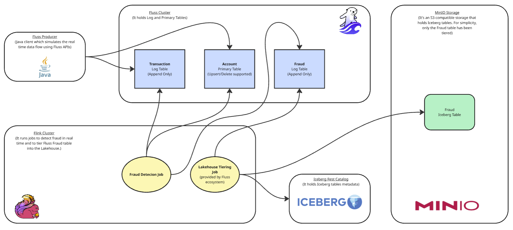
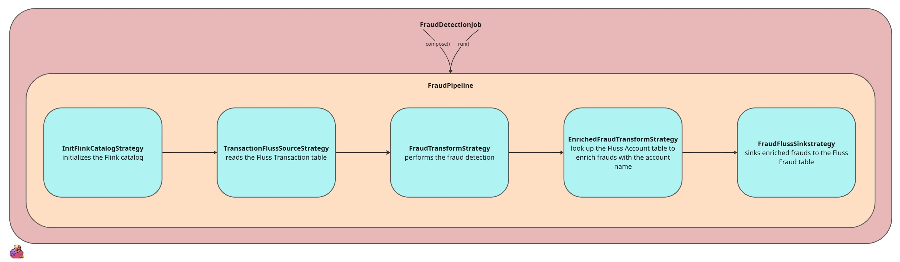
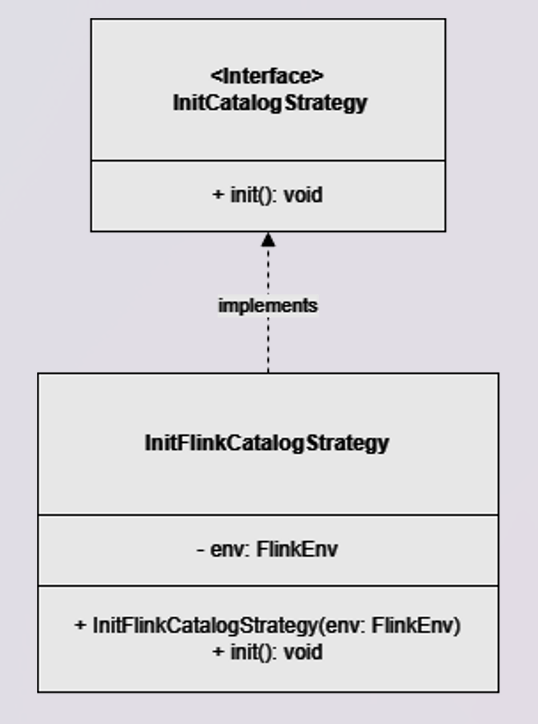
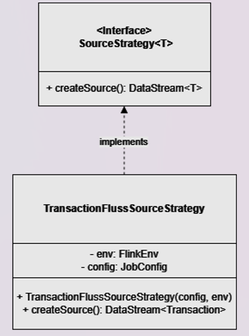
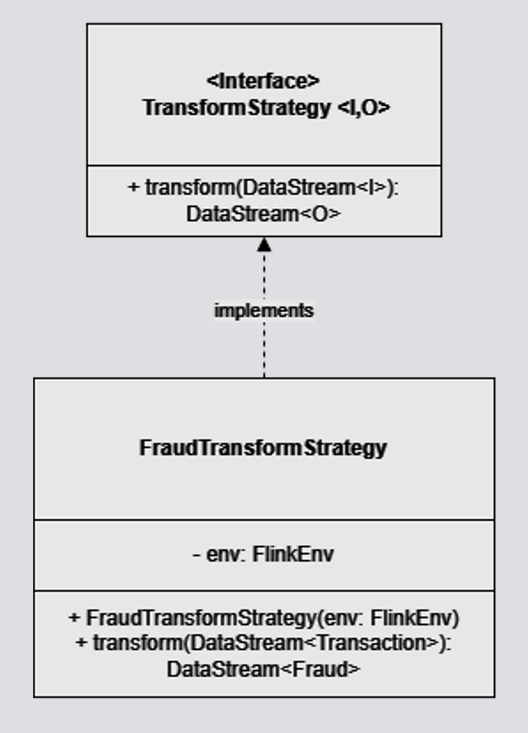
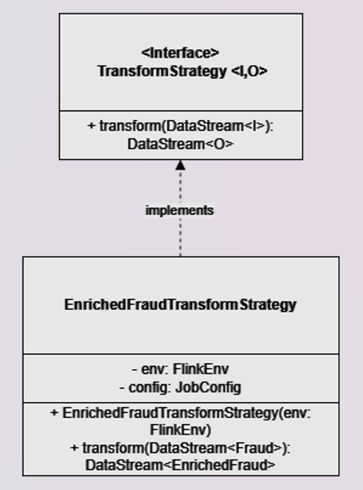
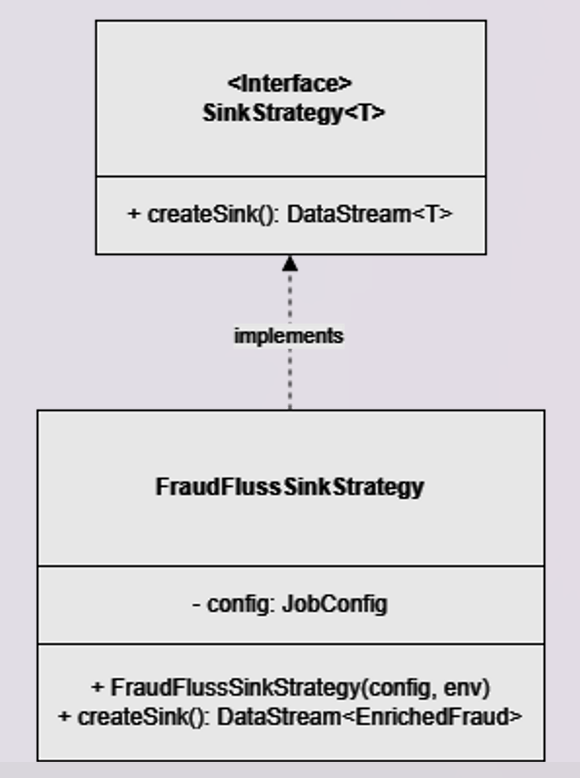

# A fraud detection pipeline with Streamhouse.
## Apache Fluss, Apache Flink and Iceberg.

Fraud detection is a mission-critical capability for businesses operating in financial services, e-commerce, and digital payments. Detecting suspicious transactions in real time can prevent significant losses and protect customers. This blog demonstrates how to build a streamhouse that processes bank transactions in real time, detects fraud, and serves data seamlessly across hot (sub‑second latency) and cold (minutes‑latency) layers.
Real-time detection and historical analytics are combined, enabling businesses to act quickly while maintaining a complete audit trail.

<!-- truncate -->

## Streamhouse Architecture
### Overview
A Streamhouse is a modern data architecture that unifies real‑time stream processing and batch processing on top of a data lake, enabling organizations to work seamlessly with both current and historical data in a single system. It bridges the traditional gap between streaming systems and lakehouse storage, delivering near–real‑time insights, cost‑efficiency, and simplified architectures.
A Streamhouse brings several major advantages:
- **Unified architecture:** No need to maintain separate streaming and batch systems; both run on the same storage and compute foundation.
- **Real‑time analytics:** Stream-native storage (e.g. Apache Fluss) enables sub‑second consumption.
- **Cost‑efficiency:** Uses a data‑lake foundation, which is cheaper and more scalable than warehouse‑centric architectures.
- **ACID guarantees:** with streaming updates when built on open table formats like Apache Iceberg.
- **Improved data freshness:** Hot data is immediately queryable by streaming processors, while cold data is efficiently stored for historical analytics.

In simple terms: a Streamhouse = Streaming + Lakehouse

A single architecture that:
- handles real‑time data (streams) through a hot layer
- handles historical data (batch) through a cold layer

The hot layer is responsible for low‑latency ingestion and real‑time processing. It is composed of:
1. **Data Producers:** these are the data sources continuously generating live event streams (applications, microservices, sensors, CDC pipelines, etc.).
Supports the overall concept of streaming ingestion into Streamhouses.
2. **Streaming Storage Layer:** this layer stores live streams and enables their immediate consumption by real‑time processors. For example Apache Fluss, which provides ultra‑low‑latency streaming storage optimized for fast ingestion and fast consumption by systems like Apache Flink or microservices. 
3. **Streaming Processors Engines:** that consume and process streaming data with low latency, such as Apache Flink, which is core to many Streamhouse implementations. These components together deliver sub‑second end‑to‑end processing latency.

The cold layer provides durable, optimized, and cost‑effective storage for large‑scale historical data and is formed by:
1. Lakehouse Storage, a data lakehouse built on an open table format (e.g., Apache Iceberg, Paimon, etc.), which provides:
    - ACID guarantees: analytical batch queries
    - unified tables for both batch and stream processing
2. Tiering Service, a background synchronization component that:
    - continuously moves or materializes data from the streaming storage layer into lakehouse tables
    - ensures the cold layer stays up to date for historical analytics

Thanks to its layered architecture, a Streamhouse enables:
1. Sub‑second latency from the hot layer
For real‑time:
    - dashboards
    - monitoring
    - alerts
    - streaming transformations
    - microservice consumption
    - agentic AI
2. Minutes‑level latency from the cold layer
For:
    - historical analytics
    - machine learning feature pipelines
    - complex batch queries
    - long‑term and fault tolerant data retention

### Tech Stack
The Streamhouse architecture enables real‑time processing of bank transactions, fraud detection, and seamless data management across both hot and cold data layers.
I implemented this architecture using the following technology stack:
- Java client application as the producer, continuously generating streams of bank transactions and account updates leveraging the [Fluss Java Client API](https://fluss.apache.org/docs/apis/java-client/) .
- Apache Fluss as the ultra‑low‑latency streaming storage layer, ingesting live event streams and enabling real‑time consumption by microservices, Flink processors, and other streaming systems.
- Apache Flink as the streaming processor, performing real‑time fraud detection and enabling immediate downstream reactions.
- Apache Iceberg as the open table format for storing the historical view of detected frauds for OLAP consumers.
- MinIO, acting as the S3‑compatible object store holding the Iceberg tables.
- Iceberg REST Catalog to manage Iceberg table metadata.
- Docker to spin up a lightweight Fluss and Flink cluster.

### Data flow



The Fluss Java Client initializes the Fluss tables on the Fluss cluster and generates live records.
Specifically, three tables are created at startup:
1. Transaction Log Table — append-only
2. Account Primary Table — supports INSERT, UPDATE, and DELETE
3. Enriched Fraud Log Table — append-only, with the datalake option enabled

The Fluss [CoordinatorServer](https://fluss.apache.org/docs/concepts/architecture/#coordinatorserver) of the cluster automatically initializes a corresponding Iceberg table on MinIO through the REST Catalog for historical storage when the corresponding Fluss table is created.
After initialization, the Fluss Java Client continuously generates transaction and account records and writes them to Fluss.
The Flink‑based fraud detection job continuously consumes transactions from the Fluss table and identifies fraudulent records in real time.
When a fraud is detected, Flink enriches the record with the account name by referencing the Fluss Account Primary Table.
The enriched fraud records are then appended to the Fluss Enriched Fraud Log Table, which is tiered into the lakehouse with the Tiering Flink Job provided by the Fluss ecosystem.

## Repository structure

You can find the code explained in this blog at the following link: [Github](https://github.com/Lourousa/frauddetection)

Here's the repository structure, which will be useful as reference for the following paragraphs:

```
src/main/java/org/jg/
    ├── FraudDetectionJob.java
    ├── config/
    │     └── JobConfig.java
    ├── utils/
    │     ├── FlinkEnv.java
    │     ├── Utils.java
    │     ├── FlussManagerRunner.java
    │     └── FlussManager.java
    ├── pipeline/
    │     ├── FraudPipeline.java
    │     └── FlinkPipeline.java
    ├── strategy/
    │     ├── EnrichedFraudTransformStrategy.java
    │     ├── FraudFlussSinkStrategy.java
    │     ├── FraudTransformStrategy.java
    │     ├── InitCatalogStrategy.java
    │     ├── InitFlinkCatalogStrategy.java
    │     ├── SinkStrategy.java
    │     ├── SourceStrategy.java
    │     ├── TransactionFlussSourceStrategy.java
    │     └── TransformStrategy.java
    ├── entity/
    │     ├── Transaction.java
    │     ├── Account.java
    │     ├── Fraud.java
    │     └── EnrichedFraud.java
    ├── function/
    │     └── FraudDetector.java
    └── serde/
          ├── TransactionDeserializationSchema.java
          ├── TransactionSerializationSchema
          ├── AccountSerializationSchema
          └── EnrichedFraudSerializationSchema.java
```

## The Fluss client: tables and record generation

A Fluss Java client acts as the data producer. In the codebase, the ```FlussManager``` and the ```FlussManagerRunner``` are the classes representing the client and its execution. The client’s role is to simulate transaction events and feed them into the Fluss tables. More specifically, the client creates the Fluss database and three tables leveraging the [Fluss Java Client API](https://fluss.apache.org/docs/apis/java-client/) . For the sake of simplicity, each table has been [distributed](https://fluss.apache.org/docs/table-design/data-distribution/bucketing/) by its ID on four buckets.

### Transaction Log Table (append-only) 

| Column       | Fluss Type    | Description                                                  |
|--------------|---------------|--------------------------------------------------------------|
| `id`         | BIGINT        | Unique identifier of the transaction.                        |
| `accountId`  | BIGINT        | Identifier of the account the transaction belongs to.        |
| `createdAt`  | BIGINT        | Creation timestamp in epoch milliseconds.                    |
| `amount`     | DECIMAL       | Monetary amount of the transaction.                          |

The table stores transactions with a retention period of 7 days. Since it is a Fluss Log table, only APPEND operations are supported.

Snippet from FlussManager.java
```java
public static Schema createTransactionSchema() {
  return Schema.newBuilder()
      .column(Transaction.ID, DataTypes.BIGINT())
      .column(Transaction.ACCOUNT_ID, DataTypes.BIGINT())
      .column(Transaction.CREATED_AT, DataTypes.BIGINT())
      .column(Transaction.AMOUNT, DataTypes.DECIMAL(10, 2))
      .build();
}

public static TableDescriptor createTransactionDescriptor(Schema schema) {
  return TableDescriptor.builder()
      .schema(schema) // the schema is created by createTransactionSchema()
      .distributedBy(4, Transaction.ACCOUNT_ID) // few buckets for local testing
      .build();
}
```
### Account Primary Table

| Column       | Fluss Type   | Description                                          |
|--------------|--------------|------------------------------------------------------|
| `id`         | BIGINT       | Unique identifier of the account. Primary key.       |
| `name`       | STRING       | Name of the account holder or entity.                |
| `createdAt`  | BIGINT       | Creation timestamp in epoch milliseconds.            |
| `updatedAt`  | BIGINT       | Last update timestamp in epoch milliseconds.         |

The table stores accounts of the bank’s customers. Since it is a Fluss Primary table, INSERT, UPDATE, and DELETE operations are supported.

Snippet from FlussManager.java
```java
public static Schema createAccountSchema() {
  return Schema.newBuilder()
      .column(Account.ID, DataTypes.BIGINT())
      .column(Account.NAME, DataTypes.STRING())
      .column(Account.UPDATED_AT, DataTypes.BIGINT())
      .primaryKey(Account.ID)
      .build();
}

public static TableDescriptor createAccountDescriptor(Schema schema) {
  return TableDescriptor.builder()
    .schema(schema)
    .distributedBy(4, Account.ID)
    .build();
}
```
### Enriched Fraud Log Table

| Column           | Fluss Type   | Description                                         |
|------------------|--------------|-----------------------------------------------------|
| `transactionId`  | BIGINT       | Identifier of the transaction flagged as fraud.     |
| `accountId`      | BIGINT       | Account identifier associated with the transaction. |
| `name`           | STRING       | Name of the account holder.                         |

The table stores enriched transactions detected as fraud, with a retention period of 7 days. Since it is a Fluss Log table, only APPEND operations are supported.
This is the only table that will be tiered to the Iceberg lakehouse.

Snippet from FlussManager.java
```java
public static Schema createFraudSchema() {
  return Schema.newBuilder()
      .column(EnrichedFraud.TRANSACTION_ID, DataTypes.BIGINT())
      .column(EnrichedFraud.ACCOUNT_ID, DataTypes.BIGINT())
      .column(EnrichedFraud.NAME, DataTypes.STRING())
      .build();
}

public static TableDescriptor createFraudDescriptor(Schema schema) {
  return TableDescriptor.builder()
      .schema(schema)
      .distributedBy(4, EnrichedFraud.TRANSACTION_ID)
      .property("table.datalake.enabled", "true")
      .property("table.datalake.freshness", "30s")
      .property("table.datalake.auto-compaction", "true")
      .build();
}
```

### Records generation
The Fluss client needs to serialize transactions and accounts POJOs instances as ```GenericRow``` instances. This class implements the ```InternalRow``` interface that represents the binary format used to write records from the Fluss client to Fluss tables.
Here is an example of the ```Transaction``` POJO and the ```TransactionSerializationSchema```, which extends ```FlussSerializationSchema<Transaction>``` to override the serialize method of the ```FlussSerializationSchema``` interface, along with how it is used by the client generating records.

Transaction.java
```java
public final class Transaction implements Serializable {

  private static final long serialVersionUID = 1L;

  public static final String ID = "id";
  public static final String ACCOUNT_ID = "accountId";
  public static final String CREATED_AT = "createdAt";
  public static final String AMOUNT = "amount";

  private long id;
  private long accountId;
  private long createdAt;
  private BigDecimal amount;
  private RowKind kind;

  public Transaction() {}

  public Transaction(long id, long accountId, long createdAt, BigDecimal amount, RowKind kind) {
    this.id = id;
    this.accountId = accountId;
    this.createdAt = createdAt;
    this.amount = amount;
    this.kind = kind;
  }
  //...
}
```

TransactionSerializationSchema.java
```java
public class TransactionSerializationSchema implements FlussSerializationSchema<Transaction> {

  private static final long serialVersionUID = 1L;

  @Override
  public void open(InitializationContext context) throws Exception {}

  @Override
  public RowWithOp serialize(Transaction value) throws Exception {
    GenericRow row = new GenericRow(4);
    row.setField(0, value.getId());
    row.setField(1, value.getAccountId());
    row.setField(2, value.getCreatedAt());
    row.setField(3, Decimal.fromBigDecimal(value.getAmount(), 10, 2));

    RowKind rowKind = value.getKind();
    switch (rowKind) {
      case INSERT:
        return new RowWithOp(row, OperationType.APPEND);
      default:
        throw new IllegalArgumentException("Unsupported row kind: " + rowKind);
    }
  }
}
```

Generation of transactions from FlussManager.java
```java
public static List<InternalRow> getTransactions(AtomicLong GLOBAL_ID, Random RANDOM)
    throws Exception {
  final long[] ACCOUNT_IDS = {1006L, 1007L, 1008L, 1009L};
  long fraudAccountId = ACCOUNT_IDS[RANDOM.nextInt(ACCOUNT_IDS.length)];
  List<Transaction> transactions = new ArrayList<>();
  transactions.add(
      new Transaction(
          GLOBAL_ID.getAndIncrement(),
          fraudAccountId,
          System.currentTimeMillis(),
          new BigDecimal("0.8"),
          RowKind.INSERT));
  transactions.add(
      new Transaction(
          GLOBAL_ID.getAndIncrement(),
          fraudAccountId,
          System.currentTimeMillis(),
          new BigDecimal("1001.00"),
          RowKind.INSERT));
  for (int i = 0; i < 8; i++) {
    transactions.add(
        new Transaction(
            GLOBAL_ID.getAndIncrement(),
            generateRandomAccountId(RANDOM),
            System.currentTimeMillis(),
            BigDecimal.valueOf(10 + RANDOM.nextInt(500)),
            RowKind.INSERT));
  }
  TransactionSerializationSchema schema = new TransactionSerializationSchema();
  schema.open(null);
  return transactions.stream()
      .map(
          tx -> {
            try {
              RowWithOp rowWithOp = schema.serialize(tx);
              return rowWithOp.getRow();
            } catch (Exception e) {
              throw new RuntimeException("Serialization failed for transaction: " + tx, e);
            }
          })
      .collect(Collectors.toList());
}
```
The ```getTransaction``` method is repeatedly called by the client to produce transactions continuously. They are pushed in batches of ten.  
The first two transactions of each batch represent a fraudulent pattern for the same account:
- a small transaction with an amount less than 1.
- a larger transaction with an amount greater than 1000.

This means that every second transaction in the batch is a fraud. This logic is very simple, since the purpose of this blog is to show Fluss as a streamhouse pillar, not to demonstrate an advanced fraud detector. The Fluss Transaction table is continuously updated by appending new records. Accounts are also generated by the client in a similar way and then written to the Fluss Account table, which acts as a dimension table, meaning its records are not upserted frequently.
For simplicity, only four accounts are generated, and each transaction belongs to one of them.
  
## Fraud detection job
### Flink pipeline overview
The Fraud detection Job is based on Apache Flink. The orchestration of the streaming pipeline has been modelled by the ```FrauDetectionJob``` class, which is the entry point of the Flink job:
```java
public class FraudDetectionJob {

  public static void main(String[] args) throws Exception {

    JobConfig config =
        JobConfig.builder()
            .bootstrapServers(FLUSS_BOOTSTRAP_SERVER_INTERNAL)
            .database(FLUSS_DB_NAME)
            .transactionTable(TRANSACTION_LOG)
            .fraudTable(FRAUD_LOG)
            .build();

    FlinkEnv env = FlinkEnv.getInstance();

    FraudPipeline pipeline =
        new FraudPipeline(
            new InitFlinkCatalogStrategy(env),
            new TransactionFlussSourceStrategy(config, env),
            new FraudTransformStrategy(env),
            new EnrichedFraudTransformStrategy(env),
            new FraudFlussSinkStrategy(config));

    pipeline.compose();
    pipeline.run(env);
  }
}
```
Each step of the streaming pipeline, such as reading from the source, applying transformations, and writing to the sink, has been modeled as a strategy. These strategies are combined into the ```FraudPipeline``` which implements the ```FlinkPipeline``` interface. The ```FlinkPipeline``` interface is accountable to hold and combine the strategies, exposing the ```compose``` and ```run``` signatures. The ```compose``` method is used to chain the strategies together, while the ```run``` method triggers the Flink execution environment.



```java
public class FraudPipeline implements FlinkPipeline {
  private final InitFlinkCatalogStrategy initFlinkCatalogStrategy;
  private final SourceStrategy<Transaction> sourceStrategy;
  private final TransformStrategy<Transaction, Fraud> transformFraudStrategy;
  private final TransformStrategy<Fraud, EnrichedFraud> transformEnrichedFraudStrategy;
  private final SinkStrategy<EnrichedFraud> sinkStrategy;

  public FraudPipeline(
      InitFlinkCatalogStrategy initStrategy,
      SourceStrategy<Transaction> sourceStrategy,
      TransformStrategy<Transaction, Fraud> transformFraudStrategy,
      TransformStrategy<Fraud, EnrichedFraud> transformEnrichedFraudStrategy,
      SinkStrategy<EnrichedFraud> sinkStrategy) {
    this.initFlinkCatalogStrategy = initStrategy;
    this.sourceStrategy = sourceStrategy;
    this.transformFraudStrategy = transformFraudStrategy;
    this.transformEnrichedFraudStrategy = transformEnrichedFraudStrategy;
    this.sinkStrategy = sinkStrategy;
  }

  @Override
  public void compose() {
    initFlinkCatalogStrategy.init();
    var transactionsDs = sourceStrategy.createSource();
    var fraudsDs = transformFraudStrategy.transform(transactionsDs);
    var enrichedFraudDs = transformEnrichedFraudStrategy.transform(fraudsDs);
    sinkStrategy.createSink(enrichedFraudDs);
  }

  @Override
  public JobExecutionResult run(FlinkEnv env) throws Exception {
    return env.getStreamEnv().execute("fraud-detection");
  }
}
```

There are 4 strategies interfaces with different accountability explained in the next paragraph.

### Strategy deep dive

#### 1. InitCatalogStrategy interface and InitFlinkCatalogStrategy implementation
This interface defines the catalog initialization, exposing the ```init``` method.



The ```InitFlinkCatalogStrategy``` implementation, which extends ```InitCatalogStrategy```, overrides the ```init``` method to define and activate a Flink catalog, enabling the use of the Fluss tables.

Snippet from InitFlinkCatalogStrategy.java
```java
@Override
public void init() {

  env.getTableEnv()
      .executeSql(
          "CREATE CATALOG fluss_catalog\n"
              + "WITH ('type' = 'fluss', 'bootstrap.servers' = 'coordinator-server:9122')");

  env.getTableEnv().executeSql("USE CATALOG fluss_catalog");
  env.getTableEnv().executeSql("USE fluss");
}
```

#### 2. SourceStrategy interface and TransactionFlussSourceStrategy implementation
This interface represents the reading from a source and returning records with a DataStream Flink API of type `DataStream<T>`, exposing the `createSource` signature.



The `TransactionFlussSourceStrategy` implementation overrides the `createSource` method to read from the Fluss Transaction table using the [FlussSource](https://fluss.apache.org/docs/engine-flink/datastream/#datastream-source) connector and return a `DataStream<Transaction>`.

Snippet from TransactionFlussSourceStrategy.java
```java
@Override
public DataStream<Transaction> createSource() {
  FlussSource<Transaction> transactionSource =
      FlussSource.<Transaction>builder()
          .setBootstrapServers(config.getBootstrapServers()) // Fluss coordinator bootstrap server e.g coordinator-server:9122
          .setDatabase(config.getDatabase())  // fluss database name e.g fluss
          .setTable(config.getTransactionTable())  // transaction table name e.g transaction
          .setStartingOffsets(OffsetsInitializer.earliest())  // initializes offsets to the earliest available offsets of each bucket
          .setDeserializationSchema(new TransactionDeserializationSchema())
          .build();
  return env.getStreamEnv()
      .fromSource(transactionSource, WatermarkStrategy.noWatermarks(), "fluss-transaction-source")
      .name("transactions-datastream");
}
```
As you can see in the snippet below , the deserialization of the Fluss `LogRecord` from the Transaction table into the `Transaction` POJO required by the DataStream type is handled by the `TransactionDeserializationSchema` class, which extends `FlussDeserializationSchema` to override the `deserialize` method. The `record` is used to instanciate a `Transaction` POJO. The corresponding changeLog type is mapped into the `kind` field and since the Fluss source is a Log Table it always equals to an insert.

Snippet from TransactionDeserializationSchema.java
```java
@Override
public Transaction deserialize(LogRecord record) throws Exception {
  InternalRow row = record.getRow();
  long id = row.getLong(0);
  long accountId = row.getLong(1);
  long createdAt = row.getLong(2);
  BigDecimal amount = row.getDecimal(3, 10, 2).toBigDecimal();
  RowKind kind = mapChangeType(record.getChangeType());
  return new Transaction(id, accountId, createdAt, amount, kind);
}
```

#### 3. TransformStrategy interface and FraudTransformStrategy implementation
This interface models the transformation applied to a Datastreams. It takes a `Datastream<I>`, returns `Datastream<O>` exposing the `transform` method.



The `FraudTransformStrategy` implementation overrides the `transform` method, which takes a `DataStream<Transaction>` as a parameter and returns a `DataStream<Fraud>` after applying the following transformations:
1. ```keyBy(Transaction::getAccountId)```: groups the Transaction stream by ```accountId``` so that all transactions with the same ```accountId``` go to the same parallel subtask. After keyBy, you get a KeyedStream, which enables per-key state and timers.
2. ```process(new FraudDetector())```: applies the ```FraudDetector``` ```KeyedProcessFunction``` to the keyed stream.
A KeyedProcessFunction is the lowest-level, per-key operator in Flink that provides:
    - Per-key state (e.g., ValueState) scoped to the current key.
    - Timers (processing-time and/or event-time) that invoke onTimer(...), also per key.
    - Ordered processing per key—events for the same key arrive in order to the same subtask.

FraudTransformStrategy.java
```java
public class FraudTransformStrategy implements TransformStrategy<Transaction, Fraud> {

  private final FlinkEnv env;

  public FraudTransformStrategy(FlinkEnv env) {
    this.env = env;
  }

  @Override
  public DataStream<Fraud> transform(DataStream<Transaction> transactionsDs) {
    return transactionsDs
        .keyBy(Transaction::getAccountId)
        .process(new FraudDetector())
        .name("fraud-detector");
  }
}
```

`FraudDetector` extends `KeyedProcessFunction<Long, Transaction, Fraud>`, where:
- `Long` is the type of the key (the `accountId`)
- `Transaction` is the input type
- `Fraud` is the output type

The fraudulent record is identified by the ```processElement``` override method which implements a simple rule:
- If a small transaction is followed by a large transaction within one minute (processing time), emit a ```Fraud```.

Snippet from FraudDetector.java
```java
@Override
public void processElement(Transaction transaction, Context context, Collector<Fraud> collector)
    throws Exception {
  Boolean lastTransactionWasSmall = flagState.value();
  if (lastTransactionWasSmall != null) {
    if (transaction.getAmount().compareTo(LARGE_AMOUNT) > 0) {
      Fraud fraud = new Fraud();
      fraud.setTransactionId(transaction.getId());
      fraud.setAccountId(transaction.getAccountId());
      collector.collect(fraud);
    }
    cleanUp(context);
  }
  if (transaction.getAmount().compareTo(SMALL_AMOUNT) < 0) {
    flagState.update(true);
    long timer = context.timerService().currentProcessingTime() + ONE_MINUTE;
    context.timerService().registerProcessingTimeTimer(timer);
    timerState.update(timer);
  }
}
```

#### 4. EnrichedFraudTransformStrategy implementation



The `EnrichedFraudTransformStrategy` implementation reads the `Datastream<Fraud>` and perform an enrichment adding the account name for each record.
This is done switching from Flink Datastream API to Flink Table API and performing a temporal look up join against the the Fluss Account table which acts as a dimension.

Snipped from EnrichedFraudTransformStrategy.java
```java
@Override
public DataStream<EnrichedFraud> transform(DataStream<Fraud> fraudsDs) {
  Table fraudsTb =
      env.getTableEnv()
          .fromDataStream(
              fraudsDs,
              Schema.newBuilder()
                  .column(TRANSACTION_ID, DataTypes.BIGINT())
                  .column(ACCOUNT_ID, DataTypes.BIGINT())
                  .columnByExpression("procTime", "PROCTIME()")
                  .build());

  env.getTableEnv().createTemporaryView("fraudsView", fraudsTb);

  Table enrichedFraudTb =
      env.getTableEnv()
          .sqlQuery(
              "SELECT\n"
                  + "  f.transactionId AS transactionId,\n"
                  + "  f.accountId AS accountId,\n"
                  + "  a.name AS name\n"
                  + "FROM fraudsView AS f\n"
                  + "LEFT JOIN account FOR SYSTEM_TIME AS OF f.procTime AS a\n"
                  + "ON f.accountId = a.id");

  return env.getTableEnv()
      .toDataStream(enrichedFraudTb)
      .map(
          row ->  
              new EnrichedFraud(
                  (long) row.getField(TRANSACTION_ID),
                  (long) row.getField(EnrichedFraud.ACCOUNT_ID),
                  (String) row.getField(EnrichedFraud.NAME),
                  RowKind.INSERT));
}
```
The ```fraudsView``` is a dynamic table created on top of the fraud stream.
It exposes a processing-time attribute.
For each record in ```f``` (```fraudsView```), the corresponding account row is looked up as it existed at the processing time of ```f``` (```f.procTime```).
Enriched records are converted back and returned as a `DataStream<EnrichedFraud>` in order to be written to the Fluss sink by the next startegy.

### 5. SinkStrategy interface and FraudFlussSinkStrategy implementation
This interface models the writing of a `Datastream<T>` to the FlinkSink, exposing the `createSink` method.



`FraudFlussSinkStrategy` reads the `Datastream<Fraud>` and sinks record to Fluss Fraud table leveraging [FlussSink](https://fluss.apache.org/docs/engine-flink/datastream/#datastream-sink) sink connector.

FraudFlussSinkStrategy.java
```java
public class FraudFlussSinkStrategy implements SinkStrategy<EnrichedFraud> {
  private final JobConfig config;

  public FraudFlussSinkStrategy(JobConfig config) {
    this.config = config;
  }

  @Override
  public void createSink(DataStream<EnrichedFraud> enrichedFraudDs) {
    FlussSink<EnrichedFraud> enrichedFraudSink =
        FlussSink.<EnrichedFraud>builder()
            .setBootstrapServers(config.getBootstrapServers())
            .setDatabase(config.getDatabase())
            .setTable(config.getEnrichedFraudTable())
            .setSerializationSchema(new EnrichedFraudSerializationSchema())
            .build();
    enrichedFraudDs.sinkTo(enrichedFraudSink).name("enriched-fraud-fluss-sink");
    enrichedFraudDs.print();
  }
}
```
## Lakehouse tiering
The Fluss Fraud table has been tiered to the lakehouse.
The lakehouse is based on Iceberg as the open table format and MinIO as the S3‑compatible object storage.
The Iceberg Fraud table is automatically initialized when the corresponding Fluss table is created by the Fluss client.
This is possible because Fluss syncs the metadata of the Fluss Fraud table with the corresponding Iceberg table.

Snippet from FlussManager.java
```java
public static TableDescriptor createFraudDescriptor(Schema schema) {
  return TableDescriptor.builder()
    .schema(schema)
    .distributedBy(4, EnrichedFraud.TRANSACTION_ID)
    .property("table.datalake.enabled", "true")
    .property("table.datalake.freshness", "30s")
    .property("table.datalake.auto-compaction", "true")
    .build();
}
```
Fluss knows the lakehouse details based on the configuration of the following ```CoordinatorServer``` properties:
```
datalake.format: iceberg
datalake.iceberg.type: rest
datalake.iceberg.warehouse: s3://fluss/data/
datalake.iceberg.uri: http://rest:8181
datalake.iceberg.s3.endpoint: http://minio:9000
datalake.iceberg.s3.path-style-access: true
```
Data is synced by the Flink tiering job provided by the Fluss ecosystem, which merges new records from the Fluss Fraud table into the Iceberg Fraud table every 30 seconds (customizable).
The Iceberg table can support historical analysis performed by other compute engines able to read the format.
To learn more details about the tiering service works you can read the official [documentation](https://fluss.apache.org/docs/streaming-lakehouse/overview/).

## Benefits of the Streamhouse with Fluss for the fraud detection use case
### Queryable Tables
Unlike Apache Kafka, where topics are not queryable, Fluss tables allow direct querying for real-time insights. You can query both the Fluss Transaction and Account tables.
### No More External Caches
There is no need to deploy or scale external caches, databases, or state stores for lookups—simply use Fluss Primary Tables. The Fluss Account table fulfills this purpose.
### Automatic Tiering to the Lakehouse
Real-time data is automatically compacted into Iceberg, via the built-in Flink service, seamlessly bridging streaming and batch.
### Union Reads
Fluss enables combined reads of real-time and historical data (Fluss tables + Iceberg), delivering true real-time analytics without duplication.
With Flink you can query both the Fraud table in Fluss and the corresponding Iceberg Fraud table at the same time, obtaining a unified view of the records, including the latest ones that are only present in Fluss because they have not been synced yet. Moving forward, the community plans to extend this capability to support additional query engines, such as Apache Spark and StarRocks, further broadening its ecosystem compatibility and adoption.

